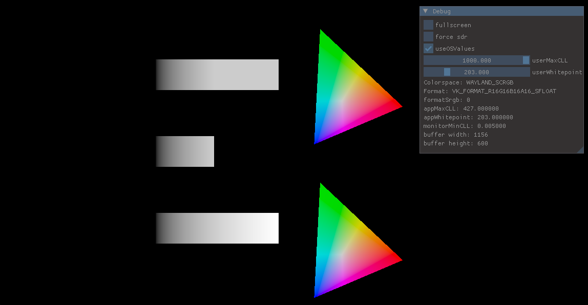

# HDR Swapchain Samples

The aim of this project is to showcase how to implement HDR features into the swapchain backend of a rendering engine. I hope this encourages more developers to implement HDR-capable output. 

When implementing HDR support, there are two major steps to consider:
 1. The internal HDR rendering: This affects the internal rendering buffers, textures, tonemapping etc.
 2. The presentation: The swapchain and metadata communication to enable the operating system display it correctly.

This project does only implement step 2. However, both steps can be considered indepently, and you can even implement a HDR backend to display regular SDR content. Because the typical sRGB/SDR output can also be seen as a specific HDR format with Bt.709 primaries and a Gamma 2.2 encoding function. This sample performs some color conversion examples inside the pixel shader.

<i>The shader will render a test scene consisting of white bars to highlight the luminance range, and of a Bt.2020 color gamut, to showcase displayable colors. The top row displays the scene how it would appear in normal SDR range, whilst the bottom row displays the full HDR range. Imgui can be used to inspect and modify some values.</i>

## Supported Backends
 * Windows - Vulkan
 * Windows - DirectX 12
 * Linux(Wayland) - Vulkan

## Supported Features
 * Check for system and Graphics API support of HDR
 * Live check for active HDR monitor
 * Fetch system values and react to changes for MinCLL, MaxCLL, whitepoint (paperwhite / reference luminance), color space
 * Imgui displays live some info and has user settings to force SDR and adjust whitepoint and MaxCLL.
 * Shader uses supplied values to convert input from linear luminance with Bt.709 primaries to output format.

## Missing Features
 * MinCLL is still not used by shader
 * HDR10 output: still defaults to scRGB
 * (Windows) Exclusive fullscreen
 * tonemapping: depends on programmer and artist intention
 * 10 bit SDR ouput support

 Dont judge the code quality. It's a mess.

## Build instructions

### Requirements:
 * CMake 4.2+
 * Vulkan SDK 1.4.341+
 * slangc compiler (on Windows: part of the Vulkan SDK)
 * (Windows) MSVC compiler
 * (Windows) Windows SDK
 * (Windows) Windows 10 Version 2004 or newer
 * (Linux) gcc/g++ compiler
 * (Linux) libwayland
 * (Linux) a system with wayland compositor and HDR support (e.g. KWin)

### Build:
1. clone the repository and the submodules with:
   
   `git clone --recurse-submodules https://github.com/LordKobra/HDR-Swapchain-Prototypes.git`

2. The project is configured and built via CMake. CMake will require console-level access to the slangc compiler.

(Windows) For the Windows SDK to work, you need to set the correct paths in the user settings at the top of the CMakeLists.txt

(Optional) The vk_enum_string_helper.h in the include folder is used to identify the colorspaces and formats. It has been modified to avoid compilation issues. Should it still bug with your version of the Vulkan SDK, go [here](https://github.com/KhronosGroup/Vulkan-Utility-Libraries/commits/main/include/vulkan/vk_enum_string_helper.h) and find the commit matching your Vulkan SDK version.

(Optional / Linux) We need to compile the Wayland protocols. For simplicity they are supplied in the wayland_protocols folder. If you have issues or want to be up-to-date, make sure you replace them with the system-supplied protocols. On my system they are located in `/usr/share/wayland-protocols/`

3. build the project with CMake.

## Run Parameters

`-dx12` Runs the program in DirectX 12 mode. Otherwise defaults to Vulkan.
## Code Structure
 - hdrManager.h/.cpp is the API agnostic state machine. Here each API can set and get the relevant values.
 - vulkanApp.h/.cpp & vulkanHDR.cpp contain the relevant code for HDR in Vulkan.
 - dxApp.h/.cpp & dxHDR.cpp contain the relevant code for HDR in DX12.
 - win32Window.h/.cpp contain the relevant code for HDR on Windows.
 - linuxWayland.h/.cpp contain the relevant code for HDR on Linux.

## Notes
* The Vulkan WSI is currently not capable of complete HDR managment. We need to query the system values ourselves and on Wayland it is also preferred to set them ourselves.

* In this example, the window systems used are Win32 an Wayland. You could technically also make it work with glfw and probably simplify the window API this way. However, glfw does not yet support setting HDR (as of July 2026), and you would have to implement this yourself for the Wayland client.

## Credits
 * [DirectX-Graphics-Samples](https://github.com/microsoft/DirectX-Graphics-Samples) for a DX HDR sample and fullscreen sample.
 * [Khronos Vulkan Tutorial](https://docs.vulkan.org/tutorial/latest/00_Introduction.html) for a basic Vulkan renderer.
 * [Wayland Book](https://wayland-book.com/) for creating a basic Wayland window.
### 
 * [Kaldaien](https://github.com/Kaldaien) for helping me with setting up HDR on Windows
 * [Darianopolis](https://github.com/Darianopolis) for helping me with setting up the Wayland client.
 * Xaver Hugl for helping me understand the Wayland color management protocol.

 ## TODO
 - explain what can be seen in the image